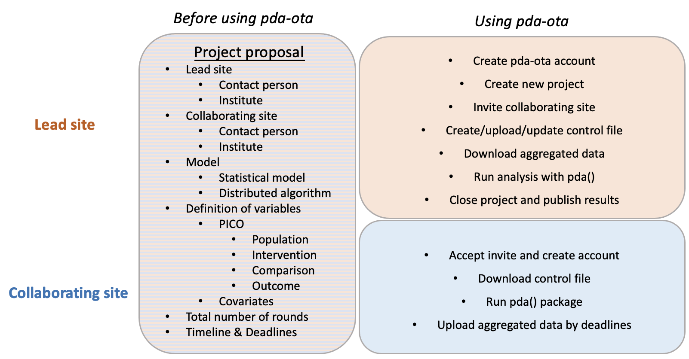

Tutorial for PDA-OTA
==============================================


## Responsibilities for lead and collaborating sites



## How to run PDA-OTA?

|          | Lead site                                | Collaborating site               |
|----------|------------------------------------------|----------------------------------|
| Step 0   | project proposal (e.g. [DLMM](https://github.com/ohdsi-studies/DistributedLMM/blob/master/extras/Lossless%20Distributed%20Linear%20Mixed%20Model.docx)) | project proposal                 |
| Step 1   | [sign up account](https://github.com/Penncil/pda-ota#step-1) if not yet |       |
|          | [create new project](https://github.com/Penncil/pda-ota#step-2) and [invite](xxx) Collaborating site to join]|                         
|          |                                          | [join project](https://github.com/Penncil/pda-ota#step-2), [sign up account](https://github.com/Penncil/pda-ota#step-1) if not yet|
| Step 2.1 | [create control file](https://github.com/Penncil/pda-ota#step-31-lead-site) |                                 |
| Step 2.2 | [upload control file](https://github.com/Penncil/pda-ota#step-32-lead-site) |                               |
| Step 2.3 |                                        | [download control file](https://github.com/Penncil/pda-ota#step-33-collaborating-site)            |
| Step 2.4 |                                       | [run pda() in R to get aggregated data](https://github.com/Penncil/pda-ota#step-34-collborating-site) |
| Step 2.5 |                                      | [upload aggregated data](https://github.com/Penncil/pda-ota#step-35-collaborating-site)     Tutorial for PDA-OTA
==============================================


## Responsibilities for lead and collaborating sites


## How to run PDA-OTA?

|          | Lead site                                | Collaborating site               |
|----------|------------------------------------------|----------------------------------|
| Step 0   | project proposal (e.g. [DLMM](https://github.com/ohdsi-studies/DistributedLMM/blob/master/extras/Lossless%20Distributed%20Linear%20Mixed%20Model.docx)) | project proposal                 |
| Step 1   | [sign up account](https://github.com/Penncil/pda-ota#step-1) if not yet |       |
|          | [create new project](https://github.com/Penncil/pda-ota#step-2) and [invite](xxx) Collaborating site to join]|                            |
|          |                                          | [join project](https://github.com/Penncil/pda-ota#step-2), [sign up account](https://github.com/Penncil/pda-ota#step-1) if not yet|

| Step 2.1 | [create control file](https://github.com/Penncil/pda-ota#step-31-lead-site) |                                 |
| Step 2.2 | [upload control file](https://github.com/Penncil/pda-ota#step-32-lead-site) |                               |
| Step 2.3 |                                        | [download control file](https://github.com/Penncil/pda-ota#step-33-collaborating-site)            |
| Step 2.4 |                                       | [run pda() in R to get aggregated data](https://github.com/Penncil/pda-ota#step-34-collborating-site) |
| Step 2.5 |                                      | [upload aggregated data](https://github.com/Penncil/pda-ota#step-35-collaborating-site)           |
| Step 2.6 | [download aggregated data](https://github.com/Penncil/pda-ota#step-41-lead-site)  from all sites |                              |
| Step 2.7 | [run pda() in R to perform intermediate analysis](https://github.com/Penncil/pda-ota#step-42-lead-site) |                            |
|          | run pda() in R to [update control file](xxx)   |         |
|          | iterate Steps 2.2 - 2.7                   |     iterate Steps 2.3 - 2.5           |
| Step 3   | [Run pda() get final results](https://github.com/Penncil/pda-ota#step-5-lead-site)              |                                  |
|          | Close project                            |                                  |


## Detailed instructions

### Step 1

Link to sign up account: http://18.221.87.50:5000/login

------------------------

### Step 2 

For lead site, create new project by clicking "+New project".

For collaborating site, join new project by clicking "+Join project". (NOTE: To join an exising project, project ID and title are required, which can be found in the invite email or please contact the lead site for these information.)

------------------------

### Step 3.1 (Lead site)


1. Install pda package, further instructions can be found here: https://github.com/Penncil/pda#how-to-install-the-pda-package.
2. Create control file:

```r
control <- list(project_name = 'Lung cancer study',
                step = 'initialize',
                sites = sites,
                heterogeneity = FALSE,
                model = 'ODAL',
                family = 'binomial',
                outcome = "status",
                variables = c('age', 'sex'),
                optim_maxit = 100,
                lead_site = '<site name>',
                upload_date = as.character(Sys.time()) )

## run in local directory:
pda(site_id = '<lead site name>', control = control, dir = getwd())
``` 

------------------------

### Step 3.2 (Lead site)

Please upload the control.json file from Step 3.1 on pda-ota website in your project.


------------------------


### Step 3.3 (Collaborating site)

Please login to pda-ota website and download the control.json file in your project.


------------------------


### Step 3.4 (Collborating site)

To get aggregated data, please run:

```r
pda(site_id = '<site name>', ipdata = <input data>, dir=getwd())
```

Note: please install pda() package (instructions can be found [here](https://github.com/Penncil/pda#how-to-install-the-pda-package.)) before run the code above.


------------------------


### Step 3.5 (Collaborating site)

Please upload the aggregated data on pda-ota website in your project.


------------------------

### Step 4.1 (Lead site)

Please download aggregated data uploaded data by all collaborating sites.

------------------------


### Step 4.2 (Lead site)

To update control file, please run the following R code:

```r
pda(site_id = '<lead site name>', ipdata = <input data>, dir=getwd())
```

------------------------

### Step 5 (Lead site)

To get final results, please run the following R code:

```r
config <- getCloudConfig(site_id = '<lead site name>', dir=getwd())
results <- pdaGet(name = 'site1_estimate', config = config)
```


     |
| Step 2.6 | [download aggregated data](https://github.com/Penncil/pda-ota#step-41-lead-site)  from all sites |                              |
| Step 2.7 | [run pda() in R to perform intermediate analysis](https://github.com/Penncil/pda-ota#step-42-lead-site) |                            |
|          | run pda() in R to [update control file](xxx)   |         |
|          | iterate Steps 2.2 - 2.7                   |     iterate Steps 2.3 - 2.5           |
| Step 3   | [Run pda() get final results](https://github.com/Penncil/pda-ota#step-5-lead-site)              |                                  |
|          | Close project                            |                                  |


## Detailed instructions

### Step 1

Link to sign up account: http://18.221.87.50:5000/login

------------------------

### Step 2.1

For lead site, create new project by clicking "+New project".

For collaborating site, join new project by clicking "+Join project". (NOTE: To join an exising project, project ID and title are required, which can be found in the invite email or please contact the lead site for these information.)

------------------------

### Step 3.1 (Lead site)


1. Install pda package, further instructions can be found here: https://github.com/Penncil/pda#how-to-install-the-pda-package.
2. Create control file:

```r
control <- list(project_name = 'Lung cancer study',
                step = 'initialize',
                sites = sites,
                heterogeneity = FALSE,
                model = 'ODAL',
                family = 'binomial',
                outcome = "status",
                variables = c('age', 'sex'),
                optim_maxit = 100,
                lead_site = '<site name>',
                upload_date = as.character(Sys.time()) )

## run in local directory:
pda(site_id = '<lead site name>', control = control, dir = getwd())
``` 

------------------------

### Step 3.2 (Lead site)

Please upload the control.json file from Step 3.1 on pda-ota website in your project.


------------------------


### Step 3.3 (Collaborating site)

Please login to pda-ota website and download the control.json file in your project.


------------------------


### Step 3.4 (Collborating site)

To get aggregated data, please run:

```r
pda(site_id = '<site name>', ipdata = <input data>, dir=getwd())
```

Note: please install pda() package (instructions can be found [here](https://github.com/Penncil/pda#how-to-install-the-pda-package.)) before run the code above.


------------------------


### Step 3.5 (Collaborating site)

Please upload the aggregated data on pda-ota website in your project.


------------------------

### Step 4.1 (Lead site)

Please download aggregated data uploaded data by all collaborating sites.

------------------------


### Step 4.2 (Lead site)

To update control file, please run the following R code:

```r
pda(site_id = '<lead site name>', ipdata = <input data>, dir=getwd())
```

------------------------

### Step 5 (Lead site)

To get final results, please run the following R code:

```r
config <- getCloudConfig(site_id = '<lead site name>', dir=getwd())
results <- pdaGet(name = 'site1_estimate', config = config)
```


